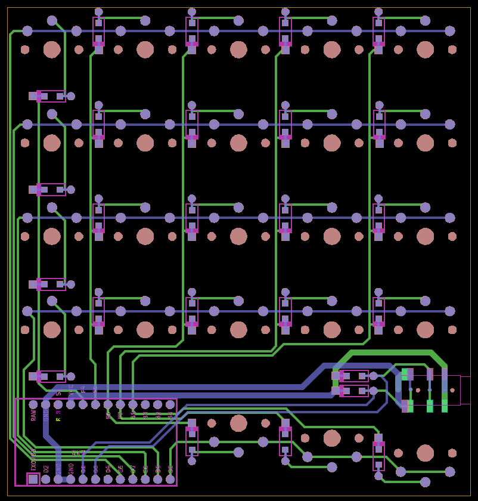
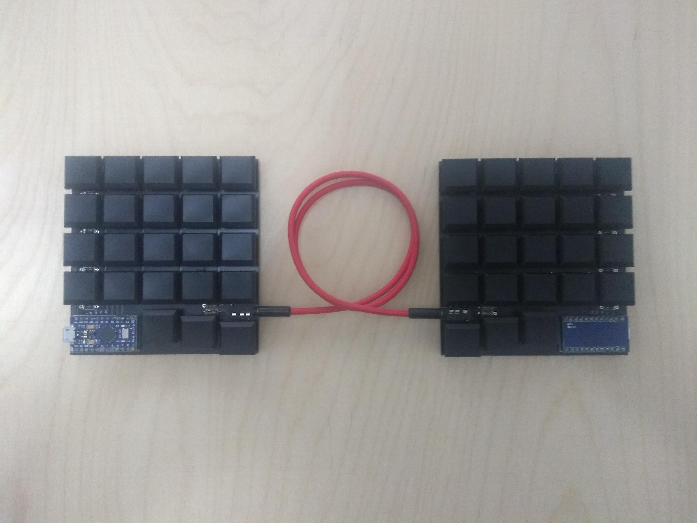
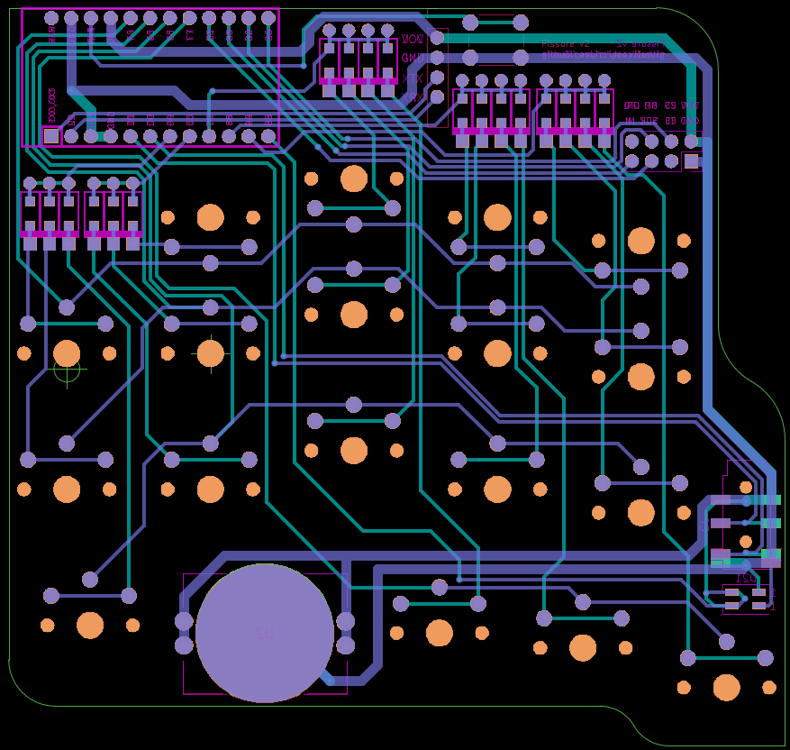
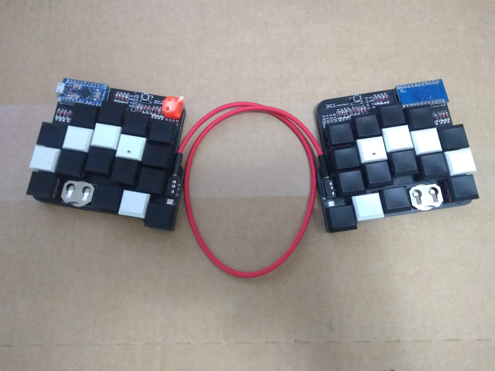

Fissure
=======

A 36/46-key split keyboard that combined the ideas of [5plit](https://oddrocketkeyboards.blogspot.com/2018/05/5plit-v2.html) and [for science](https://github.com/peej/for-science-keyboard). The current design is version 2.1. You can find keymaps and gerber files for both versions if you want to build your own.

# Background

## Version 1

I got interested in (weird/uncommon) keyboard designs in 11th grade, when I saw one of my friends using his tablet with a keyboard cover and tapping the keys while the keyboard is folded back under the tablet. I thought he was actually using the keyboard, and I came up with the idea of a back-typing keyboard. I have thought about making functional back-typing keyboards and one-handed keyboards, but I never made a usable prototype. Later, I discovered the Mechanical Keyboards sub reddit, and I decided that I want to make this keyboard.

I settled on the 46 key layout to give myself a bit more flexibility to change between different layouts, and I used a orthogonal layout as I felt it was a more standard layout so it should be easier for me to get used to.

For most people, this is already a very low key count, but because I know that in practice it's very hard to hit keys beyond your fingers' reach without moving the hands in a predictable way. It's unpredictable because my hands have to shift right 1 key (that's kind of predictable) and rotate counterclockwise so my index and middle fingers are on 9 and 0, and my ring and pinkie are on the brackets. I did it that way because it gives me a kind-of accurate and predictable way to hit all the keys to the right, but it's still not predictable enough for my brain to correctly optimize the movements.

Only firmware and gerber files are currently available, as I lost my design files when I accidentally deleted them (and I used no VCS at that time :)).

My keymap is available [here](http://www.keyboard-layout-editor.com/#/gists/f470cb5798ff4dc8b27f680a605061f3). It was the result after experimenting with many different layouts, but at the same time I try to make it easier to remember and get used to. I based this layout loosely off of normal QWERTY keyboards. Notice the number bar at the top, the symbols when shifted and function keys when raised. I also put all outside non-printable keys (e.g. Enter, Backspace, Escape) on a second layer, and only modifiers and space on the thumb clusters. I was aware of the Mod-Tap feature at the time, which allows the user to get one key when the key is tapped shortly and when the key is held down for longer. I was afraid I wasn't going to get used to that quickly. For the rest of the symbols, notice that I put the shifted ones above the non-shifted ones (except for the brackets for programming reasons), hoping that I can remember them easier.

This version used Pro Micro as the controller and I^2^C as the communication protocol beteen the halves, as I based my design mostly on the 5plit, differing only on the key layout.

The first version used Kailh Choc Brown switches. They felt good at first, but later on they felt more and more inconsistent. I could sometimes feel the bump, but other times it just feels like it's linear.

## Version 2

Version 2 was meant to be an drastic improvement over version 1, mainly to solve a lot of the issue I found in my daily usage, and to also experiment with new ideas. 

The main issue with version 1 was the layout. The number row is still too far for my small hands, and reaching them often means that I have to move my hands, which is not ergonomic and efficient in any way. I also used the Cherry MX pitch (19.05 x 19.05mm or 3/4 x 3/4 in.) for the switches, where it should be 18.5mm x 17.5mm. This meant that I had to stretch my fingers further out in order to hit the keys. The last problem is that my short pinky can't comfortably hit the <kbd>p</kbd> and <kbd>q</kbd> keys, as they are on the <kbd>a</kbd> and <kbd>;</kbd> keys when fully stretched.

To resolve the issue, I first removed the number bar from my layout, both in firmware and physically by removing the switches. The now homeless numbers and related keys on the other layers are forced to move. To tackle this, I cram some of them in the raise and lower layers, and I have to dedicate a whole new layer for miscellaneous function keys. I also tried out and got used to the Mod-Tap feature, which allows me to put some keys on the thumb clusters. To solve the last issue, I moved the pinky column down by 1 whole key (which turned out to be great).

The second issue is related to portability. As I bring my keyboard with my laptop, setting up the keyboards (plugging in the cables etc.) takes up quite some time. So I began to look into wireless solutions, and I put a bluetooth and a nrf24 wireless module footprint onto the PCB. I didn't have the wireless design ready to go yet, but this board was also meant to be an experimental version, so it doesn't matter that much if the design is not perfect. I also put a CR2032 coin cell holder hoping that I can use it for power when in wireless mode.

The last things I added are a NeoPixel RGB LED for layer and debug information, and a reset button. On version 1 there's no physical reset button, and every time I flash the firmware I have to find some metal to short the reset and ground pins :).

The gerber files for version 2 is in a separate folder (I still need to get used to version control with external-software-managed files), and there's a new version undergoing design.

The keymap can be found [here](http://www.keyboard-layout-editor.com/#/gists/99409a249d886554bd60af15782b2d50). Only the difference in the layout of the symbols are worth attention (on the lower layer). With the exception that I put the shifted symbols on the base layer (i.e. <kbd>&lt;</kbd>, <kbd>&gt;</kbd>, <kbd>:</kbd>, and <kbd>?</kbd>) on the lower layer on the same position to help me transition to using only the lower layer for symbols, all the other rows have a fixed pattern. The keys for the pinky and ring fingers on the same row are in one pair, same for the middle and index fingers. Some of the pairs might not have meaning for other people, but those are based on the meanings in Vim.
