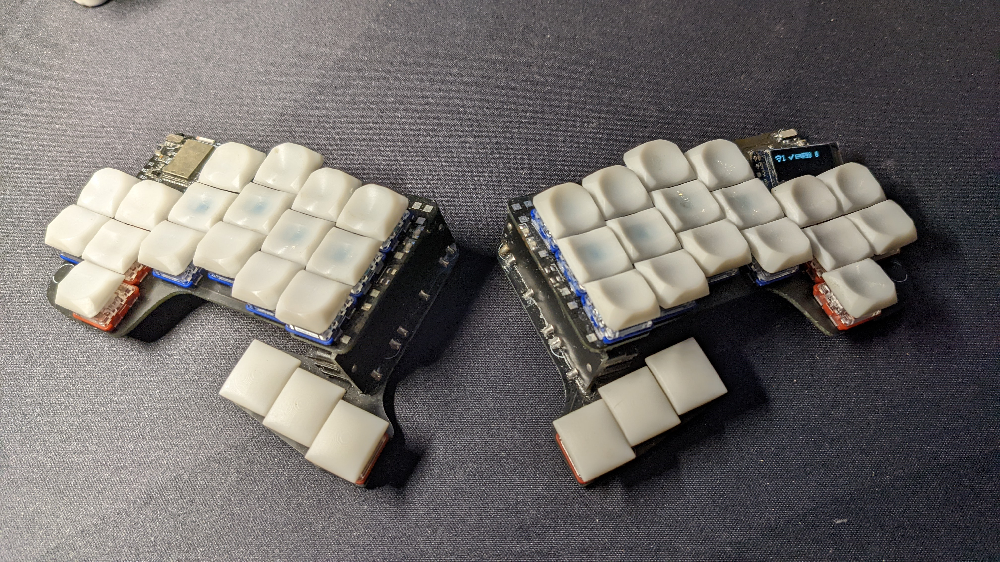
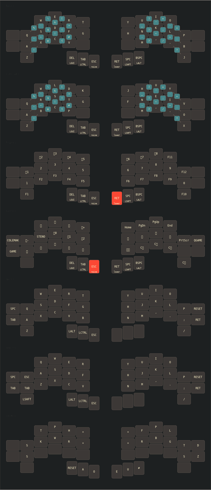

Fissure
=======

My Choc-only split keyboard for desktop use with constant experiments. See below for current keymap

You can find firmware, PCB design and gerber files for past versions if you want to build your own (I'm not used to version controlling PCB files, so if you have problems with them, please let me know). The firmware of this keyboard is based on [QMK firmware](https://github.com/qmk/qmk_firmware). The PCB files are in `pcb/`, and firmwares in `qmk/`.

For a list of all of the past versions, see [here](versions.md). Fun fact: only the first version has 46 keys, which came down to 36 after two weeks of using when I desoldered the top number row.

For a list of past keymaps, you'll have to do it manually as Keyboard Layout Editor doesn't support viewing versions of a keymap. Since the saved keymap is hosted on gist, you can check out [all the past versions of the gist](https://gist.github.com/crides/99409a249d886554bd60af15782b2d50/revisions), copy the contents of each file back into KLE to view the past keymaps.

## Picture of latest version (v3.2)

## Latest Keymap

(generated using <https://github.com/caksoylar/keymap>, source is in [keymap.yaml](./keymap.yaml). Note the existence of the lower outer pinky keys is a limitation of the graphic generator. [equivalent version on KLE](http://www.keyboard-layout-editor.com/#/gists/99409a249d886554bd60af15782b2d50))

