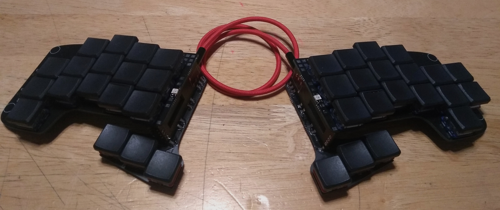
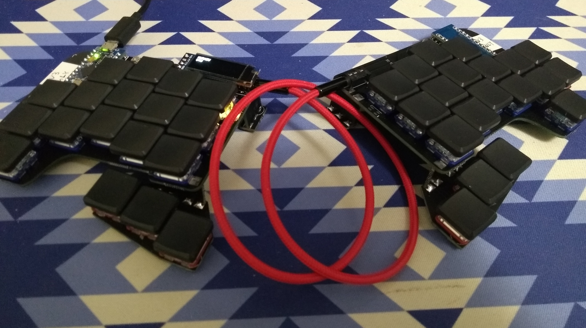
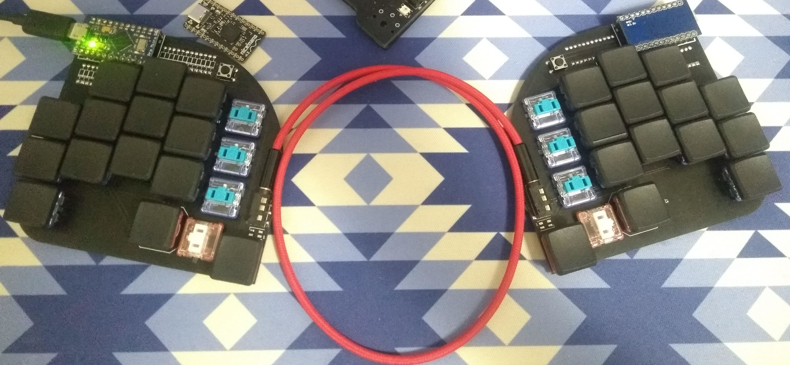

# Versions

## Version 3 - low profile?

### Version 3.1

The PCB construction on v3.0 is too complex for having 2 different vertical supports, and prone to unbalancing. In 3.1 this was changed to only 1 long vertical support, so that there are fewer PCB pieces needed, and balancing becomes much easier. The connector has been changed to flat solder-only connectors, as it's hard for pegs and holes to be aligned, connected, and be clean on the outside. The tenting has also been increased to 20mm instead of 15mm. I also attempted to make the board more compact by moving the TRRS connector and OLED screen. The latter was moved to the board connector in the middle as a experiment. The promicro has been moved below the board, as there are more room there, making it look better on the outside.

### Version 3.0

As I find tented boards to be more comfortable (my palms have never been horizontal when I type), this is an attempt at a board that "automatically tents" and have different heights for the thumb and fingers. I also integrated [embedded steno](https://github.com/crides/steno) and thus the 2 added pinky switches (they are only used on the right side, as you can tell from the pictures) and the OLED for displaying the current stroke.

## Version 2 - going smaller

A 36 key columnar-staggered version. I removed the nubmer row cuz I have dropped it in version 1. A SK6812 mini is added for status display.

The gerber files for version 2 is in a separate folder (I still need to get used to version control with external-software-managed files).

### Version 2.1

I decided that Logitech Unifying wireless is not usabily-possible, so that was dropped. Pinky stagger was increased by 2mm, and thumb cluster was rotated by 90degs so that they are closer together. Spacing was finally changed to choc spacing (17x18mm). A joystick footprint was added, but was never used due to the high force required to move the stick, and dropping 1 thumb button was quite time consuming

### Version 2.0

I wanted to go wireless with this version, and so I added a 2x4 header footprint for a nRF24 module (for potential use with a Logitech Unifying Receiver) and a coincell localtion. Spacing was changed to slightly-above-choc (i.e. 17.5x18.5mm).

## Version 1 - the start

A 46-key split keyboard that combined (in version 1) the ideas of [5plit](https://oddrocketkeyboards.blogspot.com/2018/05/5plit-v2.html) and [for science](https://github.com/peej/for-science-keyboard). This was my first ever mechanical keyboard, and I decided to go with a slightly more common layout (orthogonal & 46 key with a number row). However I quickly got rid of the number row, because it's hard for my fingers to easily reach it. It also uses MX spacing, which I quickly decided was too wide. I also botched on a RGB LED for status display.

Only firmware and gerber files are currently available, as I lost my design files when I accidentally deleted them (and I used no VCS at that time :)).

[keymap](http://www.keyboard-layout-editor.com/#/gists/f470cb5798ff4dc8b27f680a605061f3). 
